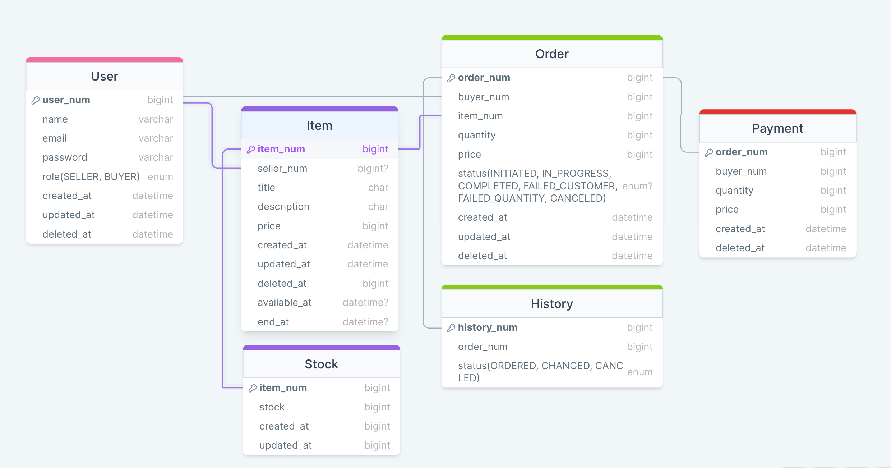

# 예약구매 서비스

## 목차
[1. 기능 소개](#기능-소개)<br/>
[2. 프로젝트 설명](#프로젝트-설명)<br/>
[3. 아키텍처 및 데이터 흐름](#아키텍처-및-데이터-흐름)<br/>
[4. 성능 테스트](#성능-테스트)(진행 중)<br/>
[5. 문제 및 해결](#문제-및-해결)(미완성)

## 기능 소개

- **유저 관리**
    - [x] 이메일 인증을 통한 회원가입
    - [x] 판매자 / 구매자로 구분
    - [x] 판매자는 상품을 등록할 수 있음
    - [x] 구매자는 상품목록 / 상세조회를 통해 상품을 확인 및 구매 요청
- **상품 관리**
    - [x] 일반상품 / 예약구매 상품으로 구분
    - [x] 예약 상품은 구매 가능 시간에만 구매 가능
    - [x] 상품 재고는 동시성 문제 해결을 위해 따로 관리
- **구매**
    - [x] 구매요청 시 특정 상황 시뮬레이션을 위해 20%확률로 구객 귀책 사유(ex. 잔액 부족)로 실패
    - [x] 예약구매의 경우 특정 시간에 주문이 몰릴 것을 가정
    - [x] 주문 성공 시 재고 반영
- **주문 정보**
    - [x] 주문한 상품 상세정보 확인
    - [x] 주문 취소 시 상품 재고 반영


## 프로젝트 설명

### 개발 환경
- 사용언어 : `Java`
- 프레임워크 : `Spring`
- 데이터베이스 : `Mysql`, `redis`
- ORM : `JPA`
- IDE : `IntelliJ`

### ERD

- 유저(User)
  - 판매자 / 구매자 구분
- 상품(Item)
  - 예약상품 여부는 available_at, end_at 필드로 확인 → null일 경우 일반 상품
- 재고(Stock)
  - 주문 요청 시 동시성 문제 해결을 위해 상품 테이블과 분리, 테이블락을 설정
- 주문(결제 요청)
  - INITIATED : 결제 진입 (시뮬레이션에서 20%확률로 고객이 주문을 취소함)
  - IN_PROGREE : 결제 진행 중
  - FAILED_CUSTOMER : 고객 귀책 사유로 주문 실패(잔액 부족 등)
  - FAILED_QUANTITY : 재고 부족으로 주문 실패
  - CANCELED : 주문 취소
- 히스토리(History)
  - 주문 상태 변경 시 정보 기록
- 결제정보(Payment)
  - 주문 성공 시 생성

### API 명세서

| 기능        | Method | URL                                     | Request                                                                                                       | Response                                                                                                                                                                                                                                                                   |
|-----------|--------|-----------------------------------------|---------------------------------------------------------------------------------------------------------------|----------------------------------------------------------------------------------------------------------------------------------------------------------------------------------------------------------------------------------------------------------------------------|
| 이메일 인증    | POST   | /api/v1/verification                    | { 'email': '' }                                                                                               | { 'status': "OK", 'message': "이메일 전송 성공", 'data': { 'email': '' } }                                                                                                                                                                                                        |
| 회원가입      | POST   | /api/v1/users/signup                    | { 'name': '', 'password': '', 'email': '', 'userRole': 'SELLER / BUYER', 'verificationCode': '' }             | { 'status': "OK", 'message': "유저 생성 성공", 'data': { 'userNum': '', 'name': '', 'email': '' } }                                                                                                                                                                              |
| 유저정보 업데이트 | PUT    | /api/v1/users/update/{userNum}          | { 'name': '' }                                                                                                | { 'status': "OK", 'message': "유저 정보 업데이트 성공", 'data': { 'userNum': '', 'name': '', 'email': '' } }                                                                                                                                                                         |
| 비밀번호 업데이트 | PUT    | /api/v1/users/update/password/{userNum} | { 'password': '' }                                                                                            | { 'status': "OK", 'message': "비밀번호 업데이트 성공", 'data': { 'userNum': '', 'name': '', 'email': '' } }                                                                                                                                                                          |
| 회원 탈퇴     | DELETE | /api/v1/users/delete/{userNum}          | -                                                                                                             | { 'status': "OK", 'message': "사용자 삭제 성공", 'data': { 'userNum': '', 'name': '', 'email': '' } }                                                                                                                                                                             |
| 상품 등록     | POST   | /api/v1/items                           | { 'sellerNum': '', 'title': '', 'description': '', 'price': '', 'stock': '', 'availableAt': '', 'endAt': '' } | { 'status': "OK", 'message': "상품 등록 성공", 'data': { 'item': { 'itemNum': '', 'sellerNum': '', 'title': '', 'description': '', 'price': '', 'createdAt': '', 'updatedAt': '', 'deletedAt': '', 'availableAt': '', 'endAt': '' }, 'stock': { 'itemNum': '', 'stock': '' } } } |
| 상품 정보 수정  | PUT    | /api/v1/items/{itemNum}                 | { 'title': '', 'description': '', 'price': '', 'stock': '', 'availableAt': '', 'endAt': '' }                  | { 'status': "OK", 'message': "상품 정보 수정 성공", 'data': { 'itemNum': '', 'sellerNum': '', 'title': '', 'description': '', 'price': '', 'stock': '', 'availableAt': '', 'endAt': '' } }                                                                                         |
| 상품 삭제     | DELETE | /api/v1/items/{itemNum}                 | -                                                                                                             | { 'status': "OK", 'message': "상품 삭제 성공", 'data': { 'itemNum': '', 'sellerNum': '', 'title': '', 'description': '', 'price': '', 'stock': '', 'availableAt': '', 'endAt': '' } }                                                                                            |
| 전체 상품 조회  | GET    | /api/v1/items                           | -                                                                                                             | { 'status': "OK", 'message': "전체 상품 조회 성공", 'data': [ ] }                                                                                                                                                                                                                  |
| 상품 상세 조회  | GET    | /api/v1/items/{itemNum}                 | -                                                                                                             | { 'status': "OK", 'message': "상품 상세 조회 성공", 'data': { 'itemNum': '', 'sellerNum': '', 'title': '', 'description': '', 'price': '', 'availableAt': '', 'endAt': '' } }                                                                                                      |
| 상품 재고 조회  | GET    | /api/v1/items/stocks/{itemNum}          | -                                                                                                             | { 'status': "OK", 'message': "상품 재고 조회", 'data': '' }                                                                                                                                                                                                                      |
| 결제 진입     | POST   | /api/v1/orders                          | { 'buyerNum': '', 'itemNum': '', 'quantity': '', 'price': '' }                                                | { 'status': "OK", 'message': "주문 진입", 'data': { 'orderNum': '', 'buyerNum': '', "itemNum": '', "quantity": '', "status": '' } }                                                                                                                                            |
| 결제 시도     | POST   | /api/v1/try-payments/{orderNum}         | -                                                                                                             | { 'status': "OK", 'message': "주문 시도 결과", 'data': { 'orderNum': '', 'buyerNum': '', "itemNum": '', "quantity": '', "status": '' } }                                                                                                                                         |
| 주문 취소     | DELETE | /api/v1/payments/{orderNum}             | -                                                                                                             | { 'status' : "OK", 'message': "주문 취소 성공", 'data' : '' }                                                                                                                                                                                                                    |


## 아키텍처 및 데이터 흐름


## 성능 테스트

### 테스트 코드
```python
import requests
import random
from concurrent.futures import ThreadPoolExecutor
from datetime import datetime

def send_http_request(buyerNum):
    order_url = "http://localhost:8080/api/v1/orders"
    payment_url = "http://localhost:8080/api/v1/orders/try-payments"

    # 20 % 확률로 고객이 주문 취소
    cancel_request = random.random() < 0.2

    if cancel_request:
        print(f"Request to {order_url} with buyerNum {buyerNum} canceled")
        return

    # 나머지 주문 생성
    try:
        # POST 요청을 보냄
        response = requests.post(order_url, json={"buyerNum": buyerNum, "itemNum": 1, "quantity": 1, "price": 1000})
        print(f"Request to {order_url} with buyerNum {buyerNum} completed with status code {response.status_code}")

        # 응답을 JSON 형식으로 파싱
        data = response.json()

        # "orderNum" 키가 있는지 확인
        if "orderNum" in data.get("data", {}):
            orderId = data["data"]["orderNum"]
            print(f"Received orderId: {orderId}")

            # 결제 요청 전송
            payment_response = requests.post(f"{payment_url}/{orderId}")

            if payment_response.status_code == 200:
                payment_data = payment_response.json()
                print(f"Payment for orderId {orderId} completed successfully, {payment_data['data']}")
            else:
                print(f"Payment for orderId {orderId} failed with status code {payment_response.status_code}")
        else:
            print("Response does not contain 'orderNum' key")

    except requests.exceptions.RequestException as e:
        print(f"Error sending request to {order_url}: {e}")

def main():
    num_requests = 10000  # 10000개 요청 전송

    start_time = datetime.now()  # 코드 실행 시작 시간

    with ThreadPoolExecutor(max_workers=100) as executor:
        tasks = [executor.submit(send_http_request, buyerNum) for buyerNum in range(1, num_requests + 1)]

        for future in tasks:
            future.result()
    
    end_time = datetime.now()  # 코드 실행 종료 시간
    duration = end_time - start_time

    print(f"실행 소요시간 {duration}")

if __name__ == "__main__":
    main()

```

### 테스트 실행 결과
- 테이블락만 적용 시(레디스 재고 관리 적용 전)


- 레디스 재고 관리 적용 시